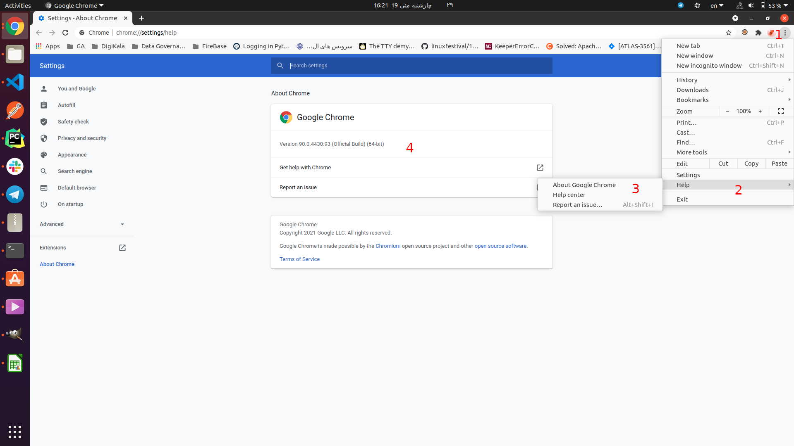

# ثبت اطلاعات تردد دیجی‌کالا

سلام؛ یکی از چالش‌هایی که بعد از عوض شدن نرم‌افزار تردد و تغییرش به سامانه‌ی همکاران سیستم باهاش مواجه شدیم، سختی کار کردن با سیستم و مخصوصا تجربه‌ی کاربریش هست. تو سیستم قبلی خیلی سریع و راحت می‌تونستیم کارکردمون رو ثبت کنیم. 

برای همین تصمیم گرفتم که با یه کد ساده‌ی پایتونی این قابلیت رو فراهم کنم با استفاده از فایل اکسل، اطلاعات ترددمون رو ثبت کنیم. در ادامه نحوه‌ی استفاده از این کد رو می‌نویسم و امیدوارم به‌دردبخور باشه.

## پیش‌نیازها
###  نصب پایتون

برای اجرا کردن این کد  که به زبان پایتون نوشته شده در قدم اول باید مطمئن باشید که روی سیستم‌تون پایتون رو نصب کردین. اگه بلد نیستین که چه‌طوری می‌شه پایتون رو روی ویندوز نصب کرد، می‌تونید به [این لینک](https://blog.faradars.org/%D9%86%D8%B5%D8%A8-%D9%BE%D8%A7%DB%8C%D8%AA%D9%88%D9%86-%D8%AF%D8%B1-%D9%88%DB%8C%D9%86%D8%AF%D9%88%D8%B2/) مراجعه کنید و خیلی راحت نصبش کنید.

**نکته** لطفا توجه کنید که حتما نسخه‌ی پایتونی که نصب می‌کنید، ۳ باشه. 

## نصب Google Chrome

برای استفاده از این ابزار، اول از همه باید [Google Chrome](https://www.google.com/chrome/) رو نصب کرده باشین. 

## نصب درایور Google Chrome

 بعد از این که مطمئن شدید روی سیستمتون Google Chrome رو نصب دارین، از [این قسمت](https://chromedriver.chromium.org/downloads) درایور مرتبط با نسخه‌ی فعلی Google Chromeتون رو نصب کنید. چون گوگل تحریممون کرده برای دسترسی به این قسمت و دانلود درایور باید در حال حاضر فیلترشکن‌تون رو روشن کنید.

 **نکته:** برای دیدن نسخه‌ی Google Chromeتون از سمت بالا راست صفحه روی سه‌نقطه کلیک کنید و توی بخش help و گزینه‌ی About Google Chrome می‌تونید ورژن دقیق رو مشاهده کنید.

بعد از این که درایور رو دانلود کردین حتما داخل پوشه‌ی driver پروژه قرارش بدین. 

## نحوه استفاده
### وارد کردن اطلاعات کاربری شخصی
برای ورود به سیستم نیاز است که اطلاعات کاربری (یعنی ایمیل و رمز عبور) رو به نرم‌افزار بدین. برای همین یک فایل به اسم `credentials.env` باید بسازید و اطلاعات حساب کاربری خودتون رو وارد کنید. 

برای آگاهی دقیق از نحوه ساختن فایل  مورد نیاز، یک فایل به نام `credentials.env.example` وجود دارد که می‌توانید با استفاده از آن فایل `credentials.env` را بسازید.

### فایل اکسل 
داخل پروژه یه پوشه به اسم timesheet هست که یه فایل اکسل داخلش به اسم `timesheet.xslx` قرار داره. داخل این فایل اکسل می‌تونید برای روزهای مشخص، اطلاعات کارکرد و مرخصی‌تون رو ثبت کنید. 

نکته‌ی قابل توجه اینه که اسم ستون‌ها (Date ،Status ،Type و ...) نباید تغییر کنه.
اما ردیف‌های مختلف رو می‌تونید اضافه کنید و اطلاعات مربوط به کارکردهاتون رو وارد کنید.

### مقادیر معتبر برای ستون‌های مختلف

| نام ستون | مقادیر معتبر |
|---|---|
| Date | اعداد باید به انگلیسی باشند و تاریخ باید به فرمت `YYYY/MM/DD` مثلا 1400/02/03 |
| Status | داده‌های مربوط به این ستون باید یکی از موارد زیر باشد: [`کارکرد ریموت`، `مرخصی استحقاقی`، `مرخصی استعلاجی` و `مرخصی توافقی`]
| Type | داده‌های مربوط به این ستون باید یکی از دو مورد `روزانه` یا `ساعتی` باشند.
| From Hour | در صورتی که در قسمت مربوط به Type گزینه‌ی `ساعتی` را انتخاب کرده‌اید، باید این قسمت را پر کنید. داده باید به فرمت `HH:MM` باشد و به اعداد انگلیسی نوشته شده باشند. مثلا 12:23
| To Hour | در صورتی که در قسمت مربوط به Type گزینه‌ی `ساعتی` را انتخاب کرده‌اید، باید این قسمت را پر کنید. داده باید به فرمت `HH:MM` باشد و به اعداد انگلیسی نوشته شده باشند. مثلا 18:45

